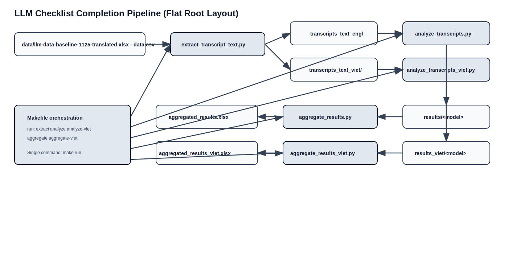

# LLM Checklist Completion

Refactored migration of the original `llm_transcript_grading` workflow into a flat, root-level repository layout.

The pipeline methods are unchanged:
1. Extract transcript text files from the source CSV.
2. Analyze ENG and VIET transcripts with the same model/prompt logic.
3. Aggregate each language result set into final Excel outputs.

## Architecture

GitHub can fail to render Mermaid in some contexts, so the diagram is committed as a static image:



Mermaid source: `docs/architecture/pipeline_architecture.mmd`

## Repository Layout (Flat)

```text
.
├── Makefile
├── pipeline_config.py
├── extract_transcript_text.py
├── analyze_transcripts.py
├── analyze_transcripts_viet.py
├── aggregate_results.py
├── aggregate_results_viet.py
├── prompts/
├── data/                       # input CSV location (gitignored)
├── transcripts_text_eng/       # generated (gitignored)
├── transcripts_text_viet/      # generated (gitignored)
├── results/                    # generated (gitignored)
├── results_viet/               # generated (gitignored)
└── docs/architecture/
```

## Prerequisites

- Python 3.8+
- OpenAI API key

Install dependencies:

```bash
pip install pandas python-dotenv openai tqdm openpyxl requests
```

## Required Input Setup

1. Create `.env` at repository root:

```env
OPENAI_API_KEY=your_api_key_here
```

2. Put the source file at:

```text
data/llm-data-baseline-1125-translated.xlsx - data.csv
```

## One Command to Produce Final Excel Outputs

Run from repository root:

```bash
make run
```

This runs:

- `extract` -> `analyze` -> `analyze-viet` -> `aggregate` -> `aggregate-viet`

Final outputs created at root:

- `aggregated_results.xlsx`
- `aggregated_results_viet.xlsx`

## Stage Commands (Optional)

```bash
make extract
make analyze
make analyze-viet
make aggregate
make aggregate-viet
```

## Notes

- Existing JSON result files are skipped by the analysis scripts.
- To force a full re-run, remove `results/` and `results_viet/` then run `make run`.
- Output schema remains metadata-first:
  - `coder`, `Prefix`, `Patient_Name`, `Case_ID`, `Filename`, then checklist variables.

## Development Checks

Run non-API regression tests:

```bash
python3 -m unittest discover -s tests -p 'test_*.py'
```
